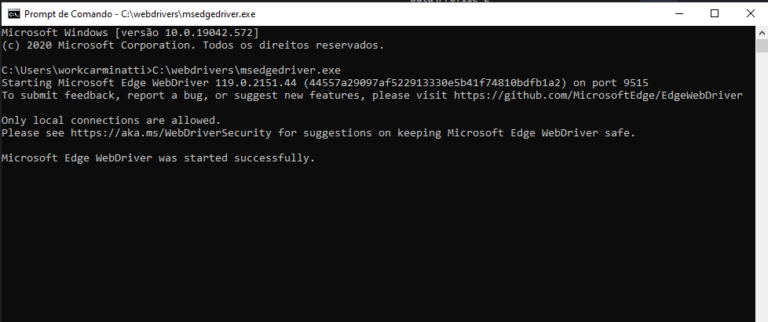

# ms-edge-search

Automação para pesquisar no edge a partir do mecanismo de busca do bing

### Tópicos 

- [Configuração Microsoft Edge e Webdriver](#edge)
- [Algoritmo](#algoritmo)
- [Consumindo API REST de notícias](#consumindo-api-noticias)

## Configuração Microsoft Edge e Webdriver

* 0.0 - Baixar e Instalar Microsoft Edge
    * Note verifique a versão do seu navegador
        * Digite na barra de navegação: edge://version
        `Minha versão = Versão do Chromium	119.0.6045.105`
        * É válido ressaltar também que podemos verificar o caminho do exec e perfil aqui, que será muito útil adiante.
        ` "Caminho do executável	C:\Program Files (x86)\Microsoft\Edge\Application\msedge.exe"`
        ` "Caminho do perfil	C:\Users\workcarminatti\AppData\Local\Microsoft\Edge\User Data1"`
* 0.1 - Baixar e Instalar Webdriver
    * Baixar a mesma versão do Microsoft Edge
* 0.2 - Configurar path
    * 0.3 Crie uma pasta neste diretório: "C:\webdriver"
    * 0.4 Aperte a tecla windows
    * 0.4.1 Digite: env
    * 0.4.2 Enter
    * 0.4.3 Acesse variáveis de ambiente
    * 0.4.4 Selecione Path
    * 0.4.5 Clique em editar
    * 0.4.6 Clique em novo
    * 0.4.7 Digite C:\webdriver
    * 0.4.8 OK
    * 0.4.9 Teste a execução no cmd `C:\webdrivers\msedgedriver.exe`
    * 0.5.0 
## Algoritmo

* 0.0 - Acessar página de pesquisa do bing no microsoft edge
* 0.1 - Encontrar alvo de pesquisa e selecionar barra
* 0.2 - Enviar noticia para a caixa de pesquisa
* 0.3 - Executar a pesquisa
  * Repetir ações --
* 0.4 - Selecionar alvo de busca
* 0.5 - Apagar 1 charactere da noticia
* 0.6 - Realizar nova pesquisa

## Consumindo API REST de notícias

